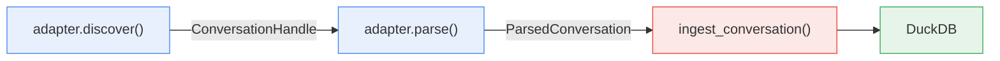

# Ingestion Pipeline

The ingestion pipeline is the core write-path of chatstrata. It takes raw conversation data from any supported provider, normalizes it into a source-agnostic schema, and persists it to DuckDB. The pipeline is designed to be **idempotent** -- re-ingesting the same conversation replaces existing data rather than duplicating it -- and **incremental**, so large archives can be updated efficiently.

## The pipeline at a glance



The pipeline has four stages:

1. **Discover** -- the adapter scans its source directory and yields lightweight `ConversationHandle` objects (no file content loaded yet).
2. **Parse** -- for each handle, the adapter reads the source file and produces a `ParsedConversation` with normalized messages, content blocks, and raw events.
3. **Normalize** -- timestamps are converted to UTC, content is hashed for dedup detection, and metadata is serialized to JSON.
4. **Persist** -- `ingest_conversation()` writes the conversation, messages, content blocks, and raw events to DuckDB with an idempotent upsert.

## Discovery

Adapters implement the `discover()` method from the `SourceAdapter` protocol. Discovery is intentionally cheap: it scans the filesystem and yields `ConversationHandle` objects without parsing file contents.

```python title="chatstrata/core/models.py"
class ConversationHandle(BaseModel):
    source_native_id: str
    path: Path | None = None
    metadata: dict[str, Any] = Field(default_factory=dict)
```

Each handle carries a `source_native_id` (the provider's own identifier for the conversation), an optional filesystem `path`, and freeform `metadata` (e.g., the project directory). The `path` field is what enables [incremental mode](#incremental-mode) -- without it, the pipeline cannot check file modification times.

The CLI applies `--limit` after discovery, truncating the handle list before any parsing begins.

## Parsing and normalization

When the ingester calls `adapter.parse(handle)`, the adapter reads the source file and returns a `ParsedConversation`:

```python title="chatstrata/core/models.py"
class ParsedConversation(BaseModel):
    source_native_id: str
    title: str | None = None
    project: str | None = None
    started_at: datetime | None = None
    ended_at: datetime | None = None
    messages: list[ParsedMessage] = Field(default_factory=list)
    raw_path: str | None = None
    raw_events: list[dict[str, Any]] = Field(default_factory=list)
```

Each `ParsedMessage` contains a `role` (user, assistant, system, or tool), an optional `model` identifier, and a list of `ContentBlock` objects. Blocks can be `text`, `tool_use`, `tool_result`, `thinking`, `image`, or `attachment`.

### Content hashing

Before persisting, the ingester computes a SHA-256 hash of the conversation's content via `_hash_content()`. The hash covers every message's role and every block's type, text, and payload (serialized with sorted keys). This `content_hash` is stored in the `conversations` table and enables dedup detection: you can query for conversations whose content changed between ingests.

```python title="chatstrata/core/ingest.py"
def _hash_content(conv: ParsedConversation) -> str:
    h = hashlib.sha256()
    for m in conv.messages:
        h.update(m.role.value.encode())
        for b in m.blocks:
            h.update(b.type.value.encode())
            if b.text:
                h.update(b.text.encode("utf-8", errors="replace"))
            if b.payload:
                h.update(
                    json.dumps(b.payload, sort_keys=True, default=str).encode("utf-8")
                )
    return h.hexdigest()
```

### UTC normalization

All timestamps pass through `_as_utc()` before persistence. Naive datetimes (no timezone info) are assumed UTC; timezone-aware datetimes are converted to UTC. This guarantees consistent ordering and filtering regardless of what timezone the source provider used.

## Persistence

The `ingest_conversation()` function is where data hits disk. It receives a DuckDB connection, a `source_id`, a `ParsedConversation`, and an optional `source_file_mtime`.

### Idempotent upsert

The function looks up an existing conversation by the composite key `(source_id, source_native_id)`:

- **If found:** it deletes the old content blocks, attachments, messages, and raw events (in FK-safe order), then updates the conversation row in place. The conversation keeps its original `id`.
- **If not found:** it inserts a new conversation with a fresh UUID.

This delete-then-reinsert approach ensures a clean replacement without partial state. Tests confirm idempotency: ingesting the same conversation twice produces the same `id` and exactly one conversation row.

!!! note
    Re-ingesting is safe -- existing data is replaced, not duplicated. The conversation retains its original chatstrata `id` across re-ingests.

After upserting the conversation row, the function inserts messages (with a `sequence_index` preserving order) and their content blocks. A second pass resolves `parent_message_id` references for tree-shaped histories (e.g., ChatGPT branching).

### Raw event preservation

If the adapter populates `raw_events`, each entry is stored line-for-line in the `raw_events` table with its `line_number` and `payload` (JSON-serialized). This is a deliberate design choice: some providers (like Claude Code) have limited retention windows. The raw events serve as an insurance policy -- even if the source files are deleted, the original data is preserved in the database and can be re-parsed by future adapter versions.

### Source registration

Before ingesting conversations, the CLI calls `ensure_source()` to register the adapter in the `sources` table. This uses an upsert keyed on `source_id`: it inserts if new, or updates `adapter_version`, `config`, and `last_ingested` if the source already exists.

## Incremental mode

For large archives, re-parsing every conversation on each ingest is wasteful. The `--incremental` flag enables file-mtime-based skipping:

1. For each `ConversationHandle`, the CLI reads the file's modification time via `os.path.getmtime()`.
2. It calls `get_stored_mtime()` to retrieve the `source_file_mtime` stored during the previous ingest.
3. If the stored mtime matches the current mtime, the conversation is **skipped**.
4. If the file is new or has been modified, it proceeds through the normal parse-and-persist path.

```
chatstrata ingest claude_code --incremental
```

The first ingest always processes everything (no stored mtimes yet). Subsequent `--incremental` runs skip unchanged files. If a handle has no `path` (e.g., API-based sources), a warning is emitted and those conversations are always processed.

## Key entry points

| Function | Location | Purpose |
|----------|----------|---------|
| `ingest` CLI command | `chatstrata/cli.py` | Orchestrates the full pipeline with progress bar, `--dry-run`, `--incremental`, `--limit` |
| `ingest_conversation()` | `chatstrata/core/ingest.py` | Persists one `ParsedConversation` to DuckDB (idempotent) |
| `ensure_source()` | `chatstrata/core/ingest.py` | Registers or updates a source adapter in the `sources` table |
| `get_stored_mtime()` | `chatstrata/core/ingest.py` | Retrieves the stored file mtime for incremental skip checks |
| `_hash_content()` | `chatstrata/core/ingest.py` | Computes SHA-256 content hash for dedup detection |
| `connect()` | `chatstrata/core/db.py` | Opens DuckDB, auto-applies pending migrations |

## Related

- [Schema design](schema.md) -- the table structure that the pipeline writes into
- [Source adapters](adapters.md) -- how to write a `discover()`/`parse()` implementation
- [Built-in sources](sources.md) -- adapter-specific details for Claude Code, claude.ai export, Codex CLI, and OpenCode
- [Migrations](migrations.md) -- how schema versions evolve over time
