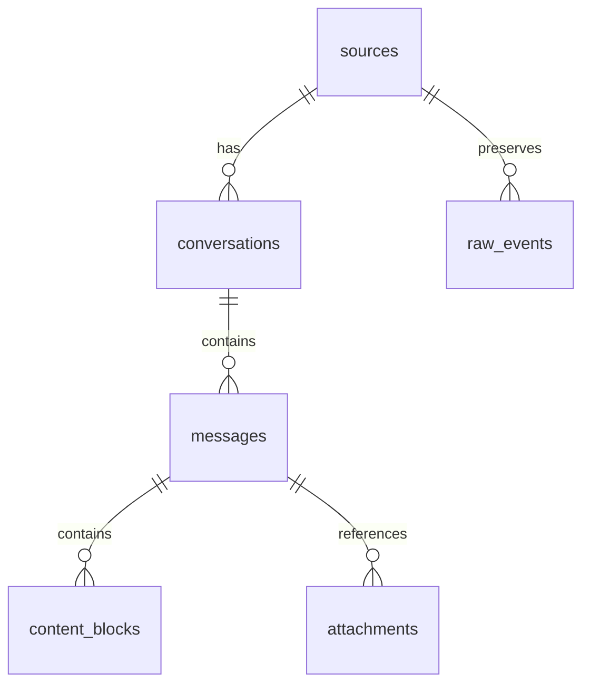

# The Canonical Schema

chatstrata ingests conversations from Claude Code, claude.ai, ChatGPT, Codex CLI, and other sources into a single DuckDB database. The canonical schema is what makes this possible: a set of tables designed so that **adding a new source never requires a schema change**. Every adapter translates its provider-specific format into the same Pydantic record types, and the ingester writes those records into the same tables regardless of where the data came from.

## Why DuckDB

The storage engine is DuckDB, chosen because chatstrata's workload is analytical, not transactional ([ADR-0001](https://github.com/brandonbosch/chatstrata/blob/main/docs/adr/0001-use-duckdb.md)). Queries like "tool call frequencies by project" or "messages per week across all sources" involve joins, aggregations, and window functions over large result sets -- exactly where a columnar engine outperforms SQLite. DuckDB also provides first-class JSON support, which means the `metadata` and `payload` JSON columns are not opaque blobs; you can query into them with standard SQL (e.g., `payload->>'command'`). The entire archive lives in a single `.duckdb` file -- easy to back up, easy to delete.

## Table structure

The schema is defined in `chatstrata/core/migrations/0001_initial.sql` and follows a normalized hierarchy:



**`sources`** -- One row per ingested provider. The `id` is a stable adapter name like `claude_code` or `chatgpt_export`. The `config` JSON column captures the adapter configuration used at ingest time, so you can always trace how data arrived.

**`conversations`** -- One row per session or thread. The `UNIQUE (source_id, source_native_id)` constraint is the idempotency mechanism: re-ingesting the same conversation replaces its rows rather than duplicating them. The `project` column captures the working directory or workspace, making it possible to filter conversations by codebase.

**`messages`** -- One row per turn. The `parent_message_id` column supports tree-shaped histories (ChatGPT branches), while `sequence_index` provides linear ordering for sources like Claude Code where conversations are strictly sequential.

**`content_blocks`** -- This is where the actual data lives. A single assistant message may contain multiple blocks: a `thinking` block, a `text` block, a `tool_use` block, and a `tool_result` block. The `type` discriminator column takes one of six values: `text`, `tool_use`, `tool_result`, `thinking`, `image`, or `attachment`. The `text` column holds the content for text and thinking blocks; the `payload` JSON column holds structured data for everything else (tool inputs, image metadata, etc.).

**`attachments`** -- File attachments referenced from messages, with optional local storage paths and content hashes.

**`message_embeddings`** -- Reserved for semantic search. Embeddings are generated lazily via the embeddings module, not during standard ingest. The composite primary key `(message_id, model)` allows storing vectors from different embedding models side by side.

## The raw_events table

The `raw_events` table preserves source data line-for-line alongside the normalized tables. This is a deliberate design choice, not an implementation detail ([ADR-0002](https://github.com/brandonbosch/chatstrata/blob/main/docs/adr/0002-store-raw-alongside-normalized.md)).

Normalization is lossy. Adapters discard fields they don't understand, collapse structure, and make best-effort mapping decisions. When an adapter author later improves their parser -- extracting a field that was previously ignored -- users need the raw source data to re-derive. The problem is that some sources don't keep data around: Claude Code's default retention is 30 days. Without `raw_events`, users who improved their parsers after that window would have no recourse.

Each raw event stores the original JSON payload, linked back to its source and conversation:

```sql title="chatstrata/core/migrations/0001_initial.sql"
CREATE TABLE IF NOT EXISTS raw_events (
    id VARCHAR PRIMARY KEY,
    source_id VARCHAR NOT NULL REFERENCES sources(id),
    source_native_conversation_id VARCHAR,
    raw_path VARCHAR,
    line_number INTEGER,
    payload JSON NOT NULL,
    ingested_at TIMESTAMPTZ NOT NULL DEFAULT current_timestamp
);
```

The storage overhead is roughly 2-3x, but for a personal archive even 100,000 messages with raw data stays well under 10 GB.

## The tool_calls view

The `tool_calls` view is a convenience layer that flattens `tool_use` content blocks into a single queryable surface with conversation and project context pre-joined:

```sql title="chatstrata/core/migrations/0001_initial.sql"
CREATE VIEW IF NOT EXISTS tool_calls AS
SELECT
    cb.id AS call_id,
    cb.tool_use_id,
    cb.tool_name,
    cb.payload AS input,
    m.id AS message_id,
    m.conversation_id,
    m.created_at,
    c.project,
    c.source_id
FROM content_blocks cb
JOIN messages m ON m.id = cb.message_id
JOIN conversations c ON c.id = m.conversation_id
WHERE cb.type = 'tool_use';
```

This makes analytical queries straightforward -- "every Bash command Claude ran in my project" is a single `SELECT` from `tool_calls` with a `WHERE project = ...` filter. Because DuckDB handles the joins efficiently, there is no materialization cost.

## How source-agnosticism works

The separation between source-specific and source-agnostic code happens at the Pydantic model layer. Every adapter's `parse()` method returns a `ParsedConversation`, which contains `ParsedMessage` objects, which contain `ContentBlock` objects. These types are defined in `chatstrata/core/models.py` and are the only types the ingester knows about:

```python title="chatstrata/core/models.py"
class ParsedConversation(BaseModel):
    source_native_id: str
    title: str | None = None
    project: str | None = None
    started_at: datetime | None = None
    ended_at: datetime | None = None
    messages: list[ParsedMessage] = Field(default_factory=list)
    raw_events: list[dict[str, Any]] = Field(default_factory=list)
```

The ingester in `chatstrata/core/ingest.py` takes this model and writes it to the database without any knowledge of whether the data came from Claude Code JSONL files, a ChatGPT export ZIP, or a claude.ai JSON export. Source-specific details live in `metadata` JSON columns, queryable but never blocking ingestion.

## Design principles

1. **Source-agnostic.** Adding a source means writing an adapter, not altering tables.
2. **Preserve the raw.** Normalization is lossy; `raw_events` ensures you can always re-derive.
3. **Idempotent ingest.** Re-running ingest replaces rather than duplicates, keyed on `(source_id, source_native_id)`.
4. **UTC timestamps.** Adapters normalize timezone-aware datetimes at parse time; the ingester enforces UTC via `_as_utc()`.
5. **Versioned.** `meta.schema_version` tracks the current version. Changes require an ADR and a migration script.

## Key entry points

- **`chatstrata/core/migrations/0001_initial.sql`** -- The DDL that creates all tables, indexes, and views.
- **`chatstrata/core/models.py`** -- Pydantic types (`ParsedConversation`, `ParsedMessage`, `ContentBlock`) that define the adapter-to-ingester contract.
- **`chatstrata/core/ingest.py`** -- The `ingest_conversation()` function that persists canonical records to DuckDB.
- **`docs/adr/0001-use-duckdb.md`** -- Design rationale for the storage engine choice.
- **`docs/adr/0002-store-raw-alongside-normalized.md`** -- Design rationale for raw data preservation.

## Related

- [Ingestion Pipeline](ingestion.md) -- How conversations flow from source files through adapters into the schema.
- [Source Adapters](adapters.md) -- How to write an adapter that produces canonical records.
- [Schema Migrations](migrations.md) -- How schema versions are tracked and upgraded.
- [Querying and Analysis](querying.md) -- Patterns for querying the canonical schema.
- [Built-in Sources](sources.md) -- Details on the Claude Code, claude.ai, ChatGPT, and Codex CLI adapters.
